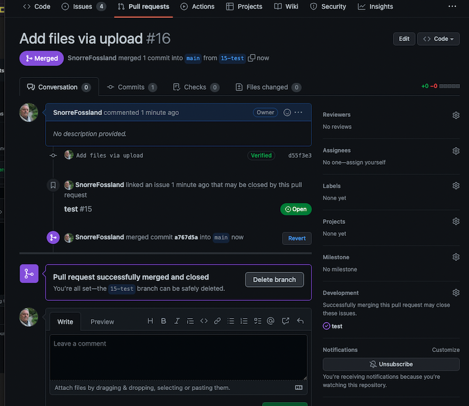

# AKM Models

This is a public repo for AKM models made in AKM Modeller and saved as .json files.

## Introduction

AKM Modelling can be done locally with models stored locally on your computer as Project.json files.
AKM Modelling can also be done as a collaborate task with several team members with Project.json files stored in a GitHub repository.

## Lets get started

(Tip: You can duplicate this browsertab and move it on the side, to have it avaiable when doing the procedure)

Open the webpage:  

<https://akmclient-beta.herokuapp.com/modelling> latest version with newest features

<https://akmclient.herokuapp.com/modelling> previous more tested version

---

## 1. Open Project files

### Open Project file

Open local project files: <code> Click: "Choose file" button</code>

Click on: Project files: "Choose file" button and select the project file you want to load (.json file).

The selected file will be loaded in the AKM Modeller.

or

Open GitHub repository AKM project files in AKM Modeller: <code> Click on: "GitHub" button</code>

..

Click on "GitHub" button to open the dialog for GitHub repository and fill in the required fields.

- Repository URL:  <https://api.github.com/users/UserName/repos/>

then click on: "LIST MODELS" button and then select a model in the "Select Model" dropdown list.

(The list is from the **main** branch of the repository.)

The model will be loaded in AKM Modeller.

Click on "X" button in the top right corner to close the GitHub repository select dialog.

---

---

## 2. Work with your model project

After updating your model project, you can save it locally.

## 3. Save your model project to Local file

To save local project files: <code> Click on: "Save" button</code>

To save the current project.json file Click on the "Save" button.

The file will default be saved in Download folder as the "Projectname"_project_"date".json file.

## 4. Upload the project file to GitHub repository

Go to the GitHub repository, and open the model folder <code> Open the model folder </code> 

(https://api.github.com/users/UserName/repos/)

Upload file (the updated or new model project.json)  <code> Drag or select file to upload and click "Commit changes" </code>

..

Drag in or "choose your files.

Select "Creat anew branch for this commit and start a pull request.

Then click "Commit changes" button.

Compare and Pull request <code> Click "Compare & pull request" button.</code>

..

Click "Compare & pull request" button.

Create Pull Request for the uploaded model project file <code> Click "Create pull request" button.</code>

..

(Add a comment and)Click "Create pull request" button.

Confirm Merge <code> Click "Confirm merge" button</code>

..

Click "Confirm merge" button.

The update of the project file to the main branch is completed <code> "Sucessfully Merged!" </code> 

..

The Main branch is updated with the new model project file

Delete you temporary branch <code> Click: "Delete branch" button</code>

..

Your branch which was created for the upload of the model project file can be deleted.

